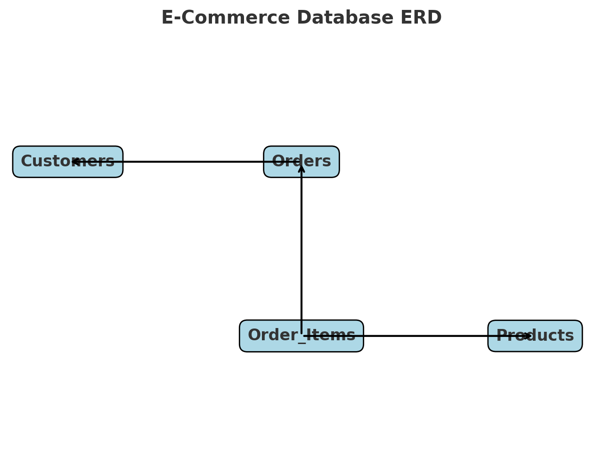

# 🛒 E-Commerce SQL Database Project

## 📌 Project Overview
This project demonstrates the design and use of a simple **E-Commerce relational database**.  
It is part of my SQL portfolio to showcase skills in schema design, querying, data aggregation, and basic optimization.

**Skills Demonstrated:**
- Relational schema design & normalization
- SQL querying (SELECT, JOINs, GROUP BY, subqueries, CTEs)
- Aggregation & reporting (top products, customer activity)
- Indexing for performance tuning
- Data insertion & management

---

## 🗄️ Database Schema
The database consists of four main tables:

- **Customers**: Stores customer information  
- **Products**: Stores product catalog data  
- **Orders**: Tracks customer orders  
- **Order_Items**: Line items within each order  

### 📊 Entity Relationship Diagram (ERD)


---

## 📂 Project Files
- **schema.sql** → SQL commands to create the database schema (tables, keys, relationships)  
- **sample_data.sql** → Example INSERT statements to populate the tables with sample data  
- **queries.sql** → Example queries demonstrating analysis, joins, and optimization  
- **ecommerce_db_erd.png** → Visual schema diagram of the database  

---

## 📝 Example Queries
- Customers who signed up after Jan 2024  
- Top 5 products by revenue  
- Orders with customer names (JOIN example)  
- Customers with no orders (subquery example)  
- Indexing example for performance  

---

## 🚀 How to Run
1. Clone this repository:  
   ```bash
   git clone https://github.com/your-username/sql-portfolio.git
   ```

2. Navigate into the project folder:  
   ```bash
   cd sql-portfolio/ecommerce-db
   ```

3. Run the schema file to create the tables:  
   ```sql
   source schema.sql;
   ```

4. Insert the sample data:  
   ```sql
   source sample_data.sql;
   ```

5. Execute the queries:  
   ```sql
   source queries.sql;
   ```

---

## 🔮 Future Improvements
- Add `Reviews` table for customer product reviews  
- Create stored procedures for automatic calculations  
- Test query performance with large datasets  
- Connect to visualization tools (Tableau, Power BI)  

---

## ✨ Author
Project created by **[Your Name]** as part of a personal SQL portfolio.  
